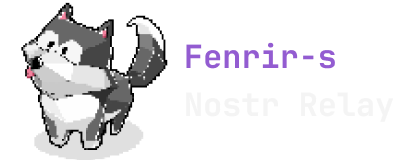

<div align="center">

  <picture>
    <source media="(prefers-color-scheme: dark)" srcset="./doc/img/logo-0.png" width="315">
    
  </picture>

</div>
<br>

<div align="center">

[](http://kotlinlang.org)
[](https://github.com/graalvm/graalvm-ce-builds/releases/tag/jdk-21.0.2)
[](http://kotlinlang.org)
[](http://kotlinlang.org)
[](https://github.com/rushmi0/Fenrir-s/blob/main/LICENSE)


[ภาษาไทย](https://github.com/rushmi0/Fenrir-s/blob/main/README.md), [日本語](https://github.com/rushmi0/Fenrir-s/blob/main/doc/README-JP.md), [English](https://github.com/rushmi0/Fenrir-s/blob/main/doc/README-EN.md)
</div>


**Fenrir-s** เป็น Nostr Relay ที่ปฏิบัติตามข้อกำหนดของ [Nostr Protocol](https://github.com/nostr-protocol/nostr)
ซึ่งพัฒนาด้วย Kotlin

โปรเจคนี้มุ่งเน้นสำหรับการใช้งานส่วนตัวหรือในกลุ่มเพื่อน สามารถกำหนดค่านโยบาย Relay ตามความต้องการ และติดตั้งได้ง่าย

## 📋 สารบัญ

- [Fenrir-s](#fenrir-s)
   - [📋 สารบัญ](#-สารบัญ)
   - [🚀 คุณสมบัติที่รองรับ (NIPs)](#-คุณสมบัติที่รองรับ-nips)
   - [⚙️ การกำหนดค่า Relay](#️-การกำหนดค่า-relay)
      - [1. กำหนดค่าข้อมูลรายละเอียดของ Relay เบื้องต้น](#1-กำหนดค่าข้อมูลรายละเอียดของ-relay-เบื้องต้น)
      - [2. กำหนดนโยบาย](#2-กำหนดนโยบาย)
      - [3. ตัวเลือกกำหนดค่าบริการพิเศษของ Relay](#3-ตัวเลือกกำหนดค่าบริการพิเศษของ-relay)
   - [🛠 ขั้นตอนการติดตั้งและใช้งาน](#-ขั้นตอนการติดตั้งและใช้งาน)
      - [การติดตั้ง](#การติดตั้ง)
      - [การตั้งค่า Cloudflare Tunnel (Optional)](#การตั้งค่า-cloudflare-tunnel-optional)
      - [การเข้าถึง Relay](#การเข้าถึง-relay)
   - [🔧 การแก้ไขปัญหาเบื้องต้น](#-การแก้ไขปัญหาเบื้องต้น)
   - [🔄 การอัปเดต](#-การอัปเดต)
   - [👥 การมีส่วนร่วมในโปรเจค](#-การมีส่วนร่วมในโปรเจค)
   - [📚 เอกสารเพิ่มเติม](#-เอกสารเพิ่มเติม)
   - [💬 ติดต่อและสนับสนุน](#-ติดต่อและสนับสนุน)

## 🚀 คุณสมบัติที่รองรับ (NIPs)

- ✅ NIP-01 Basic protocol flow
- ✅ NIP-02 Follow List
- ✅ NIP-04 Encrypted Direct Message
- ✅ NIP-09 Event Deletion
- ✅ NIP-11 Relay Information
- ✅ NIP-13 Proof of Work
- ✅ NIP-15 Marketplace
- ✅ NIP-28 Public Chat
- ⬜ NIP-40 Expiration Timestamp
- ⬜ NIP-42 Authentication of clients to relays
- ✅ NIP-50 Search Capability

## ⚙️ การกำหนดค่า Relay

### 1. กำหนดค่าข้อมูลรายละเอียดของ Relay เบื้องต้น

ไฟล์กำหนดค่าอยู่ที่ [`src/main/resources/application.toml`](src/main/resources/application.toml)

```toml
[nostr.relay.info]
name = "lnwza007"
description = "นึกแล้ว มึงต้องอ่าน"
npub = "npub1ujevvncwfe22hv6d2cjv6pqwqhkvwlcvge7vgm3vcn2max9tu03sgze8ry"
contact = "lnwza007@rushmi0.win "
```

| พารามิเตอร์ | คำอธิบาย                       |
|-------------|--------------------------------|
| name        | ชื่อของ Relay                  |
| description | คำอธิบายเกี่ยวกับ Relay        |
| npub        | npub ของเจ้าของ Relay          |
| contact     | ที่อยู่อีเมลที่สามารถติดต่อได้ |

### 2. กำหนดนโยบาย

หากไม่ได้กำหนดค่าใดๆ ค่าเริ่มต้นจะเป็น Public Relay ที่เปิดให้ทุกคนใช้งานได้

```toml
[nostr.relay.policy]
all-pass = true
follows-pass = false

[nostr.relay.policy.proof-of-work]
enabled = false
difficulty-minimum = 32
```

| พารามิเตอร์                      | คำอธิบาย                                             | ค่าเริ่มต้น | ลำดับความสำคัญ |
|----------------------------------|------------------------------------------------------|-------------|----------------|
| all-pass                         | รับ Event จากทุกคน                                   | true        | รองลงมา        |
| follows-pass                     | รับ Event เฉพาะจากคนที่เจ้าของ Relay ติดตาม (NIP-02) | false       | สูง            |
| proof-of-work.enabled            | เปิดใช้งานการตรวจสอบ Proof of Work                   | false       | สูง            |
| proof-of-work.difficulty-minimum | ค่าความยากขั้นต่ำสำหรับ Proof of Work                | 32          | -              |

> [!WARNING]\
> ค่าความยากระดับ 32 ค่อนข้างสูง หากต้องการลดความเข้มงวด แนะนำให้ตั้งค่าที่ น้อยลง หรือปิดไปเลยก็ได้

### 3. ตัวเลือกกำหนดค่าบริการพิเศษของ Relay

```toml
[nostr.relay.database.backup]
enabled = false
sync = ["wss://relay.damus.io", "wss://relay.snort.social", "wss://relay.siamstr.com", "wss://relay.notoshi.win"]
```

| พารามิเตอร์ | คำอธิบาย                                                                | ค่าเริ่มต้น |
|-------------|-------------------------------------------------------------------------|-------------|
| enabled     | เปิดใช้งานการดึงข้อมูลผู้ติดตามของเจ้าของ Relay (NIP-02) จาก Relay อื่น | false       |
| sync        | รายการ Relay อื่นๆ ที่จะดึงข้อมูลมา                                     | -           |

## 🛠 ขั้นตอนการติดตั้งและใช้งาน

> [!IMPORTANT]\
> ต้องติดตั้ง [Docker](https://www.docker.com/products/docker-desktop/) ให้เสร็จเรียบร้อยก่อนนะครับ
> และแน่ใจว่าเปิดใช้งานอยู่

### การติดตั้ง

1. โคลนโปรเจคและเข้าสู่ไดเรกทอรี:

```shell
git clone https://github.com/rushmi0/Fenrir-s.git
cd Fenrir-s
```

2. ปรับแต่งไฟล์ `application.toml` ตามต้องการ

3. รัน Docker Compose:

```shell
docker compose up relay-db relay-app-jvm
```

### การตั้งค่า Cloudflare Tunnel (Optional)

1. สร้าง Cloudflare Tunnel และรับ Token
2. แก้ไขไฟล์ [docker-compose.yml](docker-compose.yml) และใส่ Token ในส่วนของ `cloudflared-tunnel` service

### การเข้าถึง Relay

หลังจากรัน Docker สำเร็จ คุณสามารถเข้าถึง Relay ได้ที่:

- ws://localhost:6724 (ภายในเครื่อง)
- wss://your-domain.com (ผ่าน Cloudflare Tunnel, หากตั้งค่าไว้)

## 🔧 การแก้ไขปัญหาเบื้องต้น

- **ปัญหา**: Docker ไม่สามารถรันได้\
  **วิธีแก้**: ตรวจสอบว่า Docker ทำงานอยู่และมีสิทธิ์เพียงพอ

- **ปัญหา**: ไม่สามารถเชื่อมต่อกับ Relay ได้\
  **วิธีแก้**: ตรวจสอบการตั้งค่า firewall และพอร์ตที่ใช้

## 🔄 การอัปเดต

เมื่อมีเวอร์ชันใหม่ของ Fenrir-s:

1. หยุดการทำงานของ Docker containers
2. Pull โค้ดล่าสุดจาก GitHub
3. รีบิวด์และรีสตาร์ท containers

```shell
git pull
docker compose down
docker compose up --build -d
```

## 👥 การมีส่วนร่วมในโปรเจค

1. รายงานปัญหา -> Open Issue บน GitHub
2. ส่ง Pull Request พร้อมคำอธิบายการปรับปรุงเปลี่ยนแปลง

## 📚 เอกสารเพิ่มเติม

- [Nostr Protocol Specification](https://github.com/nostr-protocol/nips)
- [Kotlin Documentation](https://kotlinlang.org/docs/home.html)

## 💬 ติดต่อและสนับสนุน

- Nostr : `lnwza007@rushmi0.win`
- Zap : ⚡rushmi0@getalby.com

---

หากมีคำถามหรือข้อเสนอแนะเพิ่มเติม Open Issue ได้เลย!
