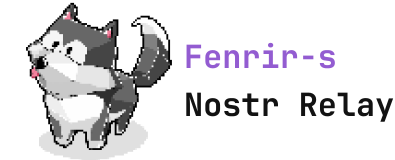

<div align="center">

  <picture>
    <source media="(prefers-color-scheme: dark)" srcset="./img/logo-px-white.svg" width="445">
    
  </picture>

</div>
<br>
<br>

<div align="center">

[](http://kotlinlang.org)
[](https://github.com/graalvm/graalvm-ce-builds/releases/tag/jdk-21.0.2)
[](https://github.com/micronaut-projects/micronaut-core)
[](https://docs.docker.com/desktop/release-notes/)
[](https://www.postgresql.org/about/news/postgresql-15-released-2526/)
[](https://github.com/rushmi0/Fenrir-s/blob/main/LICENSE)

[ภาษาไทย](https://github.com/rushmi0/Fenrir-s/blob/main/README.md), [日本語](https://github.com/rushmi0/Fenrir-s/blob/main/doc/README-JP.md), [English](https://github.com/rushmi0/Fenrir-s/blob/main/doc/README-EN.md)
</div>


**Fenrir-s** is a Nostr Relay that adheres to the specifications of
the [Nostr Protocol](https://github.com/nostr-protocol/nostr), developed using Kotlin.

This project is intended for private use or within a group of friends. It allows for custom Relay policy configurations
and is easy to set up.

## 📋 Table of Contents

- [Fenrir-s](#fenrir-s)
    - [📋 Table of Contents](#-table-of-contents)
    - [🚀 Supported Features (NIPs)](#-supported-features-nips)
    - [⚙️ Relay Configuration](#-relay-configuration)
        - [1. Basic Relay Details Configuration](#1-basic-relay-details-configuration)
        - [2. Policy Configuration](#2-policy-configuration)
        - [3. Special Service Configuration Options](#3-special-service-configuration-options)
    - [🛠 Installation and Usage](#-installation-and-usage)
        - [Installation](#installation)
        - [Cloudflare Tunnel Configuration (Optional)](#cloudflare-tunnel-configuration-optional)
        - [Accessing the Relay](#accessing-the-relay)
    - [🔧 Troubleshooting](#-troubleshooting)
    - [🔄 Updating](#-updating)
    - [👥 Contributing to the Project](#-contributing-to-the-project)
    - [📚 Additional Documentation](#-additional-documentation)
    - [💬 Contact and Support](#-contact-and-support)

## 🚀 Supported Features (NIPs)

- ✅ NIP-01 Basic protocol flow
- ✅ NIP-02 Follow List
- ✅ NIP-04 Encrypted Direct Message
- ✅ NIP-09 Event Deletion
- ✅ NIP-11 Relay Information
- ✅ NIP-13 Proof of Work
- ✅ NIP-15 Marketplace
- ✅ NIP-28 Public Chat
- ⬜ NIP-40 Expiration Timestamp
- ⬜ NIP-42 Authentication of clients to relays
- ✅ NIP-50 Search Capability

## ⚙️ Relay Configuration

### 1. Basic Relay Details Configuration

Configuration file is located at [`src/main/resources/application.toml`](src/main/resources/application.toml)

```toml
[nostr.relay.info]
name = "lnwza007"
description = "นึกแล้ว มึงต้องอ่าน"
npub = "npub1ujevvncwfe22hv6d2cjv6pqwqhkvwlcvge7vgm3vcn2max9tu03sgze8ry"
contact = "lnwza007@rushmi0.win"
```

| Parameter	   | Description              |
|--------------|--------------------------|
| name	        | Name of the Relay        |
| description	 | Description of the Relay |
| npub	        | Relay owner's npub       |
| contact	     | Contact email address    |

### 2. Policy Configuration

If no configuration is set, the default will be a Public Relay open for everyone.

```toml
[nostr.relay.policy]
all-pass = true
follows-pass = false

[nostr.relay.policy.proof-of-work]
enabled = false
difficulty-minimum = 32
```

| Parameter                         | Description                                      | Default	 | Priority |
|-----------------------------------|--------------------------------------------------|----------|----------|
| all-pass	                         | Accept Events from everyone	                     | true	    | Low      |
| follows-pass	                     | Accept Events only from followed users (NIP-02)	 | false	   | High     |
| proof-of-work.enabled	            | Enable Proof of Work verification	               | false	   | High     |
| proof-of-work.difficulty-minimum	 | Minimum difficulty level for Proof of Work	      | 32       | 	-       |

> [!WARNING]\
> A difficulty level of 32 is quite high. If you want to lower the strictness, it is recommended to set a lower value or
> disable it altogether.

### 3. Special Service Configuration Options

```toml
[nostr.relay.database.backup]
enabled = false
sync = ["wss://relay.damus.io", "wss://relay.snort.social", "wss://relay.siamstr.com", "wss://relay.notoshi.win"]
```

| Parameter	 | Description                                               | 	Default |
|------------|-----------------------------------------------------------|----------|
| enabled	   | Enable fetching follower data (NIP-02) from other Relays	 | false    |
| sync	      | List of other Relays to fetch data from	                  | -        |

## 🛠 Installation and Usage

> [!IMPORTANT]\
> Make sure you have Docker installed and running.

### Installation

1. Clone the project and navigate to the directory::

```shell
git clone https://github.com/rushmi0/Fenrir-s.git
cd Fenrir-s
```

2. Customize the application.toml file as needed.

3. Run Docker Compose:

```shell
docker compose up relay-db relay-app-jvm
```

- `relay-app-jvm` : JVM 21
- `relay-app-native` : Native Binaries

### Cloudflare Tunnel Configuration (Optional)

1. Create a Cloudflare Tunnel and obtain a Token.
2. Edit the [docker-compose.yml](docker-compose.yml) file and insert the Token under the `cloudflared-tunnel` service

### Accessing the Relay

Once Docker is successfully running, you can access the Relay at:

- ws://localhost:6724 (local machine)
- wss://your-domain.com (via Cloudflare Tunnel, if configured)

## 🔧 Troubleshooting

- **Issue**: Docker is not running\
  **Solution**: Ensure Docker is running and has sufficient permissions.

- **Issue**: Unable to connect to the Relay\
  **Solution**: Check firewall settings and the port being used.

## 🔄 Updating

When a new version of Fenrir-s is available:

1. Stop the running Docker containers.
2. Pull the latest code from GitHub.
3. Rebuild and restart the containers.

```shell
git pull
docker compose down
docker compose up --build -d
```

## 👥 Contributing to the Project

1. Report issues -> Open an Issue on GitHub.
2. Submit a Pull Request with a description of the improvements or changes.

## 📚 Additional Documentation

- [Nostr Protocol Specification](https://github.com/nostr-protocol/nips)
- [Kotlin Documentation](https://kotlinlang.org/docs/home.html)

## 💬 Contact and Support

- Nostr : `lnwza007@rushmi0.win`
- Zap : ⚡rushmi0@getalby.com

--- 
If you have any questions or suggestions, feel free to open an issue!
